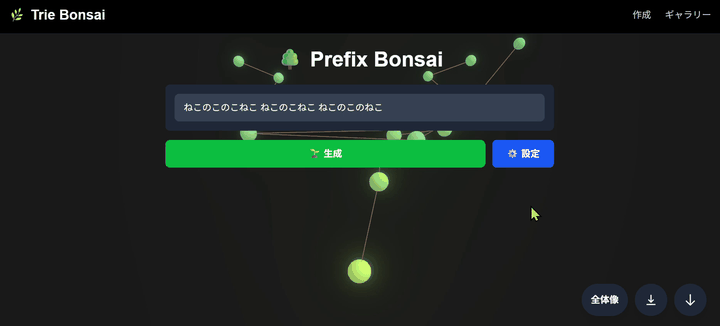
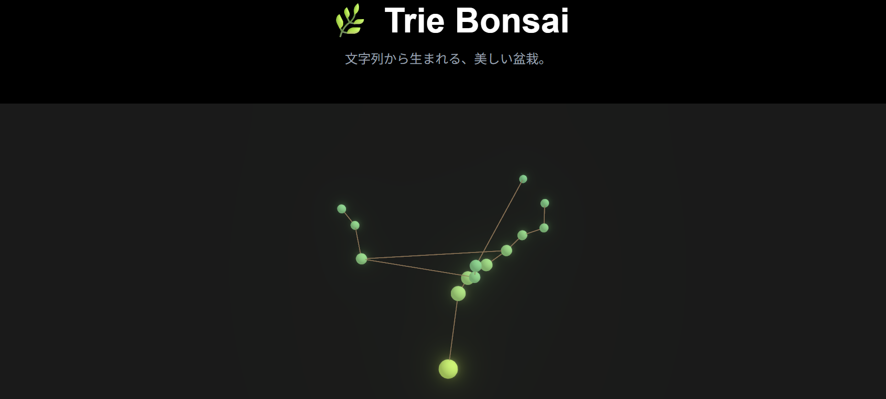
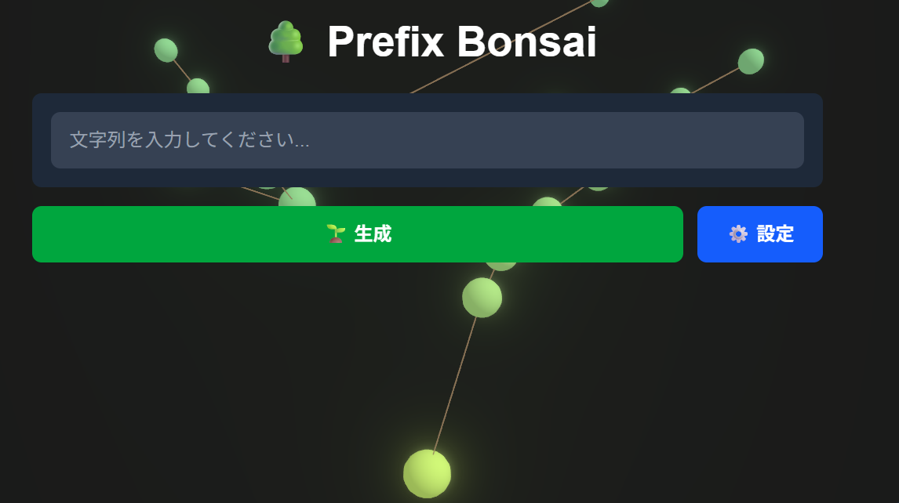
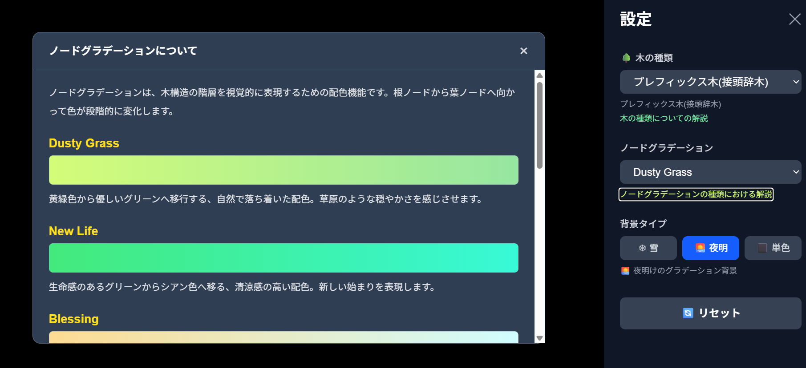
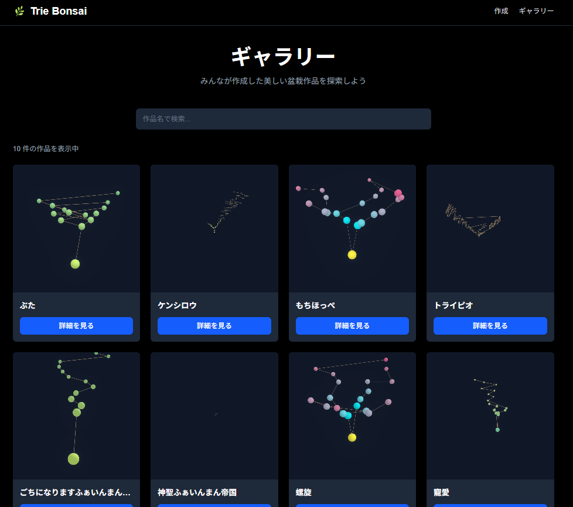
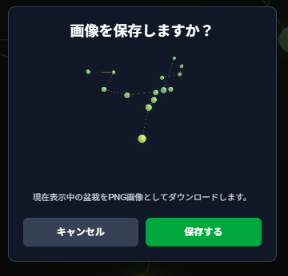
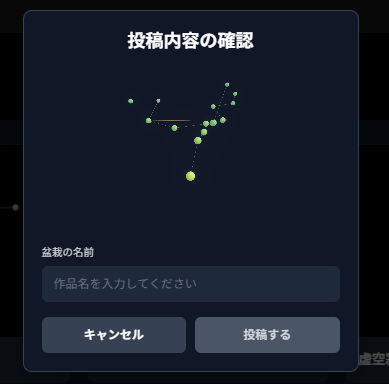
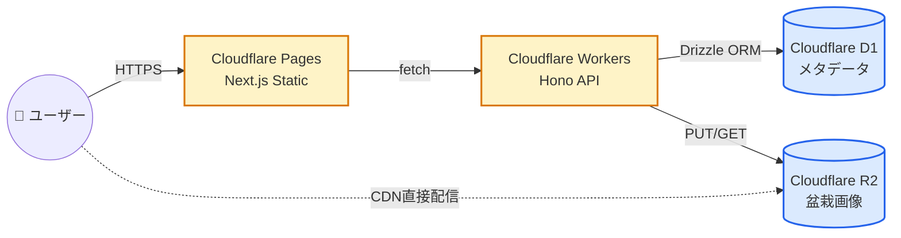
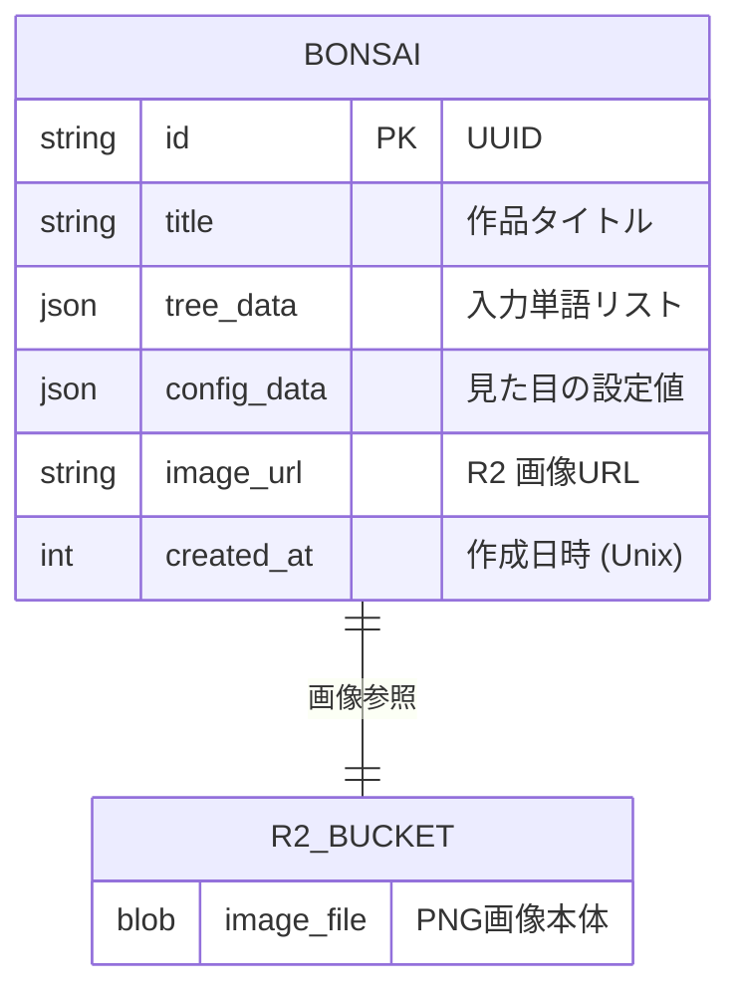

# 🌿 Trie Bonsai

> 文字列から生まれる、美しい盆栽。


<br />

## 紹介記事

開発の経緯・技術選定・こだわりポイントについては、Qiita の記事で詳しく解説しています。

[【個人開発】文字列から「盆栽」が育つWebアプリを作りました](https://qiita.com/feynman_1729/items/57b31d0778694da77009)

<br />

## サービスのURL

ログイン不要で、その場で文字を入力するだけで盆栽が育ちます。まずは触ってみてください。

https://2939976d.trie-bonsai.pages.dev/

<br />

## サービスへの想い

「データ構造を、教科書の中の抽象的な絵ではなく、手のひらに置きたくなる盆栽として表現したい」 — Trie Bonsai はそんな想いから生まれた個人プロジェクトです。

Trie 木（トライ木）は文字列の共通接頭辞を枝として共有する木構造で、辞書検索やオートコンプリートで広く使われています。その性質は枝分かれしながら育つ植物に似ています。本アプリは、入力された単語群から構築される Trie 木を、3D 空間上の盆栽として可視化し、データ構造の美しさを直感的に味わえる体験を目指しました。

技術面では「Cloudflare のエッジスタックだけで本番運用に耐えるプロダクトを一人で組み上げる」ことを学習目標に設定し、Pages・Workers・D1・R2 のフルマネージドな組み合わせで構築しています。

<br />

## アプリケーションのイメージ



文字を入力すると、共通接頭辞ごとに枝分かれしながらリアルタイムに盆栽が成長します。マウスドラッグで自由に視点を変え、好きな角度から鑑賞できます。

<br />

## 機能一覧

| トップ画面 | 作成画面 |
| ---- | ---- |
|  |  |
| 「文字列から生まれる、美しい盆栽。」をキャッチコピーに、サンプル盆栽を背景にしたランディングページ。そのまま作成ページへ遷移できます。 | 文字列を入力して「生成」を押すと、Trie 木が 3D 盆栽として背面にリアルタイム描画されます。「設定」から木の種類・配色・背景を切り替え可能。 |

| 設定画面 | ギャラリー画面 |
| ---- | ---- |
|  |  |
| 木の種類（プレフィックス木 / Patricia 木 / Suffix 木）、ノードグラデーション（Dusty Grass / New Life / Blessing / mochiHoppe など）、背景タイプ（雪 / 夜明 / 単色）を切り替え。各項目には解説モーダルを完備。 | 公開された盆栽作品を一覧表示。作品名で検索でき、カードをクリックすると個別の作品詳細ページへ遷移します。サムネイル画像は R2 から直接配信されるため高速に表示されます。 |

| 画像保存モーダル | ギャラリーへの投稿 |
| ---- | ---- |
|  |  |
| 現在表示中の盆栽を PNG 画像としてローカルにダウンロード。Canvas を `toDataURL()` でスナップショット化しています。 | 作品にタイトルを付けて公開。画像は R2、メタデータは D1 へ並列保存され、個別 URL でいつでも鑑賞できるようになります。 |

<br />

## 使用技術

| Category | Technology Stack |
| --- | --- |
| Frontend | TypeScript, Next.js 16 (App Router), React 19, React Three Fiber, Drei, Postprocessing |
| 3D / Visualization | Three.js, Leva (GUI), 再帰的放射状レイアウト |
| State Management | Zustand |
| Styling | Tailwind CSS v4 |
| Backend | TypeScript, Hono (Cloudflare Workers) |
| ORM / DB | Drizzle ORM, Cloudflare D1 (SQLite互換) |
| Object Storage | Cloudflare R2 (S3互換, パブリックCDN配信) |
| Hosting | Cloudflare Pages (Frontend), Cloudflare Workers (API) |
| CI / Deployment | Wrangler, GitHub 連携による自動デプロイ |
| Dev Tools | ESLint, Prettier, Drizzle Kit |

<br />

## システム構成図



エッジ側で全ての処理を完結させることで、低遅延と低運用コストを両立しています。ギャラリーの画像は Workers を経由せず R2 から直接 CDN 配信され、Egress 課金も発生しません。

<br />

## ER 図



Cloudflare D1 では Single Table Design を採用し、構造データと表示設定を JSON カラムにまとめることで正規化を省略しています。

<br />

## 今後の展望

MVP として 8 フェーズの開発を完了し、現在は本番運用中です。今後は鑑賞体験と表現力の拡張を進めていきます。

- **達成済み (Phase 1〜8)**: Trie ロジック実装、3D 可視化、物理演算レイアウト、Cloudflare エッジ基盤、永続化 API、ギャラリー、本番デプロイ
- **次フェーズ**: パトリシア木・サフィックス木の切り替え UI、テーマカラー（季節）プリセット、作品への簡易リアクション
- **長期構想**: ユーザーアカウント、コレクション機能、Web Share API による画像共有強化

<br />

## ローカル開発

<details>
<summary>セットアップ手順を開く</summary>

### 前提

- Node.js 20.x 以上
- npm

### フロントエンド

```bash
npm install
npm run dev
```

`http://localhost:3000` で起動します。

### バックエンド (Workers API)

```bash
cd workers/api
npm install
npm run dev
```

`http://localhost:8787` で起動します。`wrangler.toml` にダミー ID が設定済みのため、追加設定なしで起動可能です。

### 主要スクリプト

| Scope | Command | 内容 |
| --- | --- | --- |
| Frontend | `npm run dev` | 開発サーバー起動 |
| Frontend | `npm run build` | 本番ビルド |
| Frontend | `npm run lint` | ESLint 実行 |
| Workers | `npm run dev` | Wrangler 開発サーバー |
| Workers | `npm run typecheck` | TypeScript 型チェック |
| Workers | `npm run db:generate` | Drizzle マイグレーション生成 |
| Workers | `npm run deploy` | 本番 Workers へデプロイ |

本番デプロイの詳細は [DEPLOY_GUIDE.md](DEPLOY_GUIDE.md) を参照してください。

</details>

<br />

## ドキュメント

詳細な設計資料は GitHub Wiki に整理しています。

- [要件定義書](https://github.com/WeegieCat/Trie-Bonsai/wiki/%E8%A6%81%E4%BB%B6%E5%AE%9A%E7%BE%A9%E6%9B%B8)
- [ロードマップ](https://github.com/WeegieCat/Trie-Bonsai/wiki/%E3%83%AD%E3%83%BC%E3%83%89%E3%83%9E%E3%83%83%E3%83%97)
- [UML（アーキテクチャ / ER / ユースケース / シーケンス図）](https://github.com/WeegieCat/Trie-Bonsai/wiki/UML)
- [SBOM](https://github.com/WeegieCat/Trie-Bonsai/wiki/SBOM)

<br />

## ライセンス

このプロジェクトは個人学習・研究用途として開発されています。
